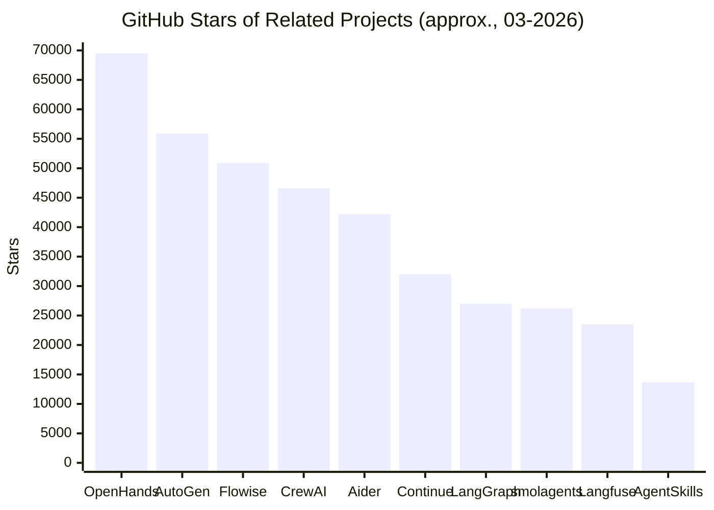
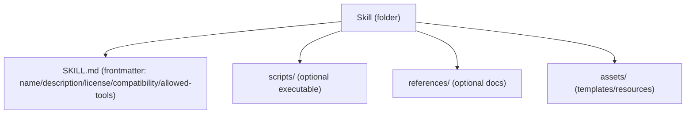
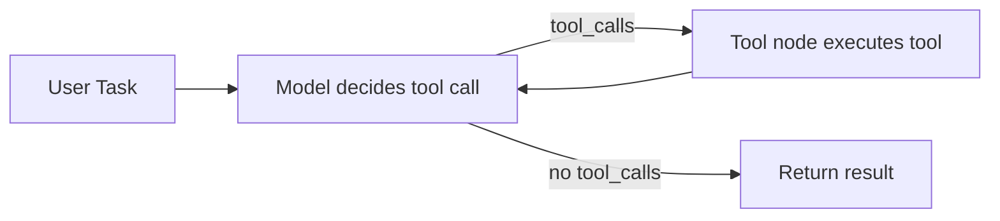
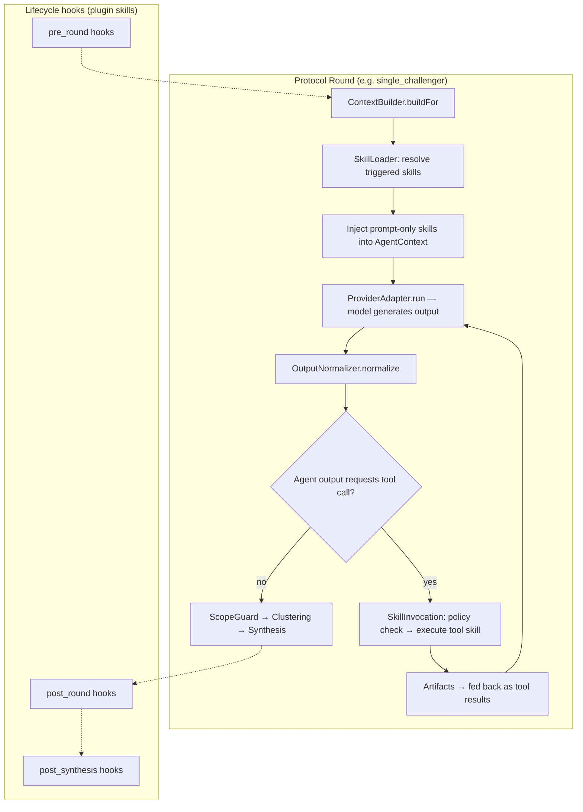
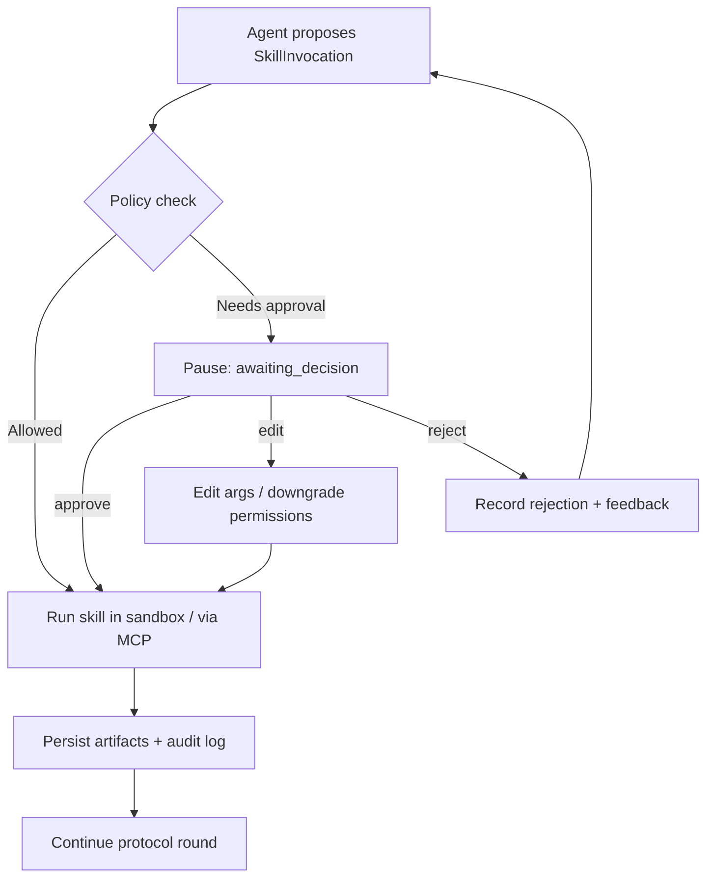
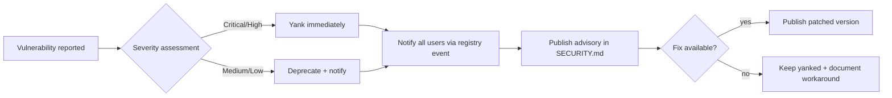
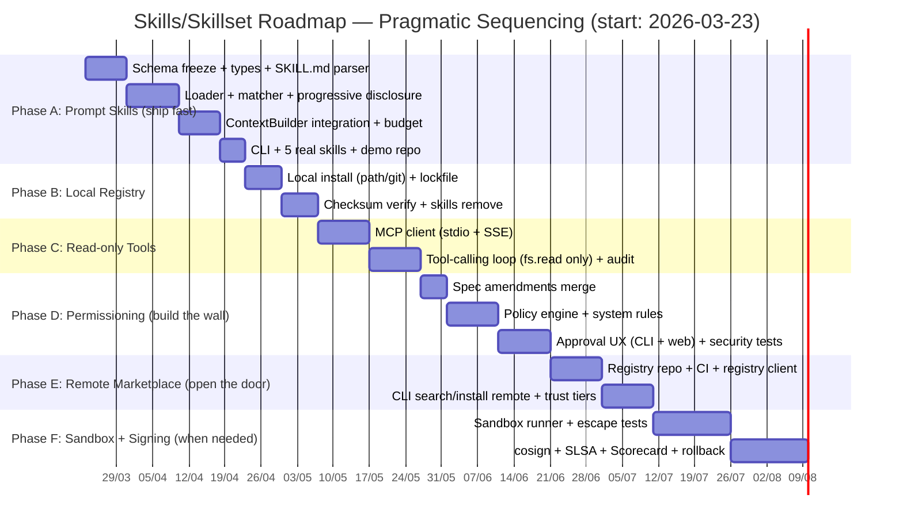

# Extending Agent Orchestra with an OSS-first Skills/Skillset Model for Code Agents

## Executive Summary

Extending Agent Orchestra with a "skills/skillset" model (superpower-style Code Agents) is **technically feasible** if deployed along a **"risk ladder"** (progressively increasing risk): **Prompt Skills → Tool Skills (MCP) → Executable Plugin Skills (sandbox)**, and if **permissions + supply-chain security** are treated as foundational requirements rather than optional features. The agent/tool ecosystem is rapidly converging on **tool registry/skill bundles** and **protocol-based tool integration** (MCP), but this also introduces real risks: **prompt injection**, **tool poisoning/hijacking**, and **SSRF/RCE** from skills that can execute code or make network calls. citeturn20search11turn12search4turn30view2turn26view0turn30view1

### Strategic Recommendations

**Skills standard:** Prioritize **Agent Skills standard compatibility** (skills as folders containing `SKILL.md` + scripts/resources, with license/compatibility/allowed-tools metadata). This is an open standard supported by multiple agent systems; GitHub describes Agent Skills as an "open standard" used across many AI ecosystems. citeturn20search11turn9view1turn21view0

**OSS marketplace:** Follow a **separate registry repo** model (like OpenHands' official skill registry and public extensions repo for skills/plugins) for better contribution governance, automated validation, and supply-chain control. citeturn14view0turn28view0turn15view0

**Safety:** Treat every executable skill/plugin as **untrusted code**. Implement a clear "permission + sandbox boundary" (deny-by-default) plus "human-in-the-loop" for sensitive actions. The MCP spec itself recommends human-in-the-loop for tool invocations and explicit display of tool calls to users. citeturn9view0turn10view2 This aligns with HITL middleware in LangChain/LangGraph and responds to published research on tool-use/tool-selection attacks. citeturn33view1turn30view2turn11search21

**Gaps to fill now** (commonly missing from initial plans): **security threat model/RFC for skills**, **maturity model (prompt-only → read-only exec → write/network)**, **signing/attestation/provenance process**, and **clear marketplace governance** (review, deprecate, incident response). citeturn10search0turn10search13turn10search2turn27search8turn26view0

---

## Current Spec and Skills Compatibility

### Spec Primitives That Support Skills Naturally

Based on spec v1.3 (canonical internal document), Agent Orchestra already has primitives well-suited for skills/skillset extension:

**Agent/Lens/Protocol:** `AgentLens` (logic, regression, testing, performance, security, ...) and protocols like `single_challenger`, `reviewer_wave`, `builder_plus_reviewer`. With "superpower skills", **skillsets become an extension layer on top of lens/role**: lens = "perspective", skill = "capability + workflow + tools". (Spec §4.4, §4.3)

**Agent registry:** `AgentConfig/AgentAssignment` already has flags like `allowReferenceScan` and `canWriteCode` (coarse-grained permissions). This is a good starting point for upgrading to **capability-based permissions** for skills. (Spec §4.10)

**Pause points:** `JobRuntimeConfig.pausePointsEnabled` and the `awaiting_decision` job state show the platform already considers "stop/review points" — a natural fit for "approve/edit/reject" before running risky skills. The MCP spec itself recommends that applications should include human-in-the-loop for tool invocations and display tool calls transparently to users. (Spec §4.12; the "approve/edit/reject" concept mirrors both MCP's HITL recommendation and LangChain HITL middleware). citeturn9view0turn10view2turn33view1

**ContextBuilder/ContextBudget:** The spec emphasizes `ContextBuilder` + `ContextBudgetManager`. Skills (especially prompt-based) will compete for tokens; therefore skills need **progressive disclosure** / "load on demand" to avoid context overflow. This is exactly the approach used by Agent Skills standard and OpenHands. citeturn9view1turn9view0

### Missing Pieces for Full Skill Support

The following items are **not clearly specified** in the current spec and should be marked **Unspecified**. They are critical for skills marketplace viability and safety:

| Item | Status in Spec v1.3 | Why It Matters for Skills |
|------|---------------------|--------------------------|
| Skill manifest/schema (id/version/license/capabilities) | Unspecified | Without a schema, there is no validation, no permissioning, no compatibility management. citeturn9view1 |
| Skill registry & distribution (local/remote/marketplace) | Unspecified | Marketplace needs indexing, version pinning, review process. citeturn15view0turn21view0 |
| Tool-calling runtime & execution boundary | Unspecified (only provider adapters/bridge as future direction) | Executable skills require sandbox/permissions; without them, RCE/SSRF/secret leaks are highly likely. citeturn31view0turn26view0turn26view1 |
| Fine-grained permission model (fs/net/proc/env) | Unspecified (only `canWriteCode`/`allowReferenceScan`) | Research shows attacks targeting tool selection & prompt injection on agent tool-use; least privilege is essential. citeturn30view2turn30view1turn30view3 |
| Supply-chain policy: signing, provenance, dependency validation | Unspecified | Plugin/skill ecosystems are supply-chain attack surfaces; needs SLSA/attestation/cosign/Scorecard. citeturn10search13turn10search2turn10search0turn10search11 |

### Working Assumptions

Since the spec does not directly define skills, this report assumes:

Agent Orchestra will add a "Skill System" layer that **does not break the output normalization pipeline** (`OutputNormalizer` remains deterministic/pure per spec §35.1). Skills will produce "artifacts" or "tool results" that can be logged, and (depending on type) injected into prompts as context or fed into a tool-calling loop.

If these assumptions do not match the product direction, the design recommendations below still apply at the principle level (registry + permissioning + sandbox + governance), but integration points must be adjusted.

### Spec Conflicts & Required Amendments

The following conflicts between this plan and spec v1.3 must be resolved via formal spec amendments before implementation proceeds past milestone 1.

| Conflict | Spec v1.3 Reference | Plan Assumption | Required Amendment |
|----------|---------------------|-----------------|-------------------|
| **Bridge / external tool integration is deferred** | §26 ("Bridge premature"), §28.2, Appendix A | Milestone 3 introduces MCP tool sources as a core feature | Amend §26 to define a scoped "Skill Tool Runtime" separate from the general-purpose Bridge. Specify: supported MCP transports, how tool schemas map to AgentOutput, and that this is limited to skill-declared tools (not arbitrary external integrations). |
| **Permission model is coarse-grained** | §4.10 — only `allowReferenceScan` and `canWriteCode` exist | Plan requires fine-grained capabilities (fs.read, fs.write, proc.spawn, net.http, secrets.read) | Amend §4.10 `AgentConfig` to include a `capabilities` field (or separate `SkillPolicy` type) extending beyond the two existing boolean flags. Preserve existing flags as backward-compatible shortcuts. |
| **`awaiting_decision` UX is undefined** | §24 ("awaiting_decision UX undefined", listed as known gap) | Plan requires approve/edit/reject flow for skill invocations | Amend §24 to define the decision UX contract: payload structure, available actions (approve/edit/reject), and how edited arguments are validated before re-submission. |
| **No artifact/tool-result persistence model** | Not in spec | Skills produce artifacts (test results, scan reports, benchmark data) that must be stored and referenced | Add a new section defining `SkillArtifact` type and its relationship to `Finding` and `AgentOutput`. Artifacts should be loggable, auditable, and optionally includable in subsequent round contexts. |

**Action required:** Draft these amendments as an RFC before milestone 3 begins. Milestone 1 (prompt-only skills) does not conflict with the current spec and can proceed immediately.

### Forward-Looking Predictions (Design Implications)

Two trends are near-certain to affect the skill system design within 6-12 months:

1. **Standardization of skill/tool integration** around open formats (Agent Skills) and protocol-based tool servers (MCP). GitHub already describes Agent Skills as an open standard with skills at both project scope and personal scope. citeturn8view0 Designing for compatibility now avoids costly rewrites later.

2. **Attacks targeting tool selection and registry poisoning will increase.** ToolHijacker (2025) proved that "tool library poisoning" via adversarial tool descriptions is a viable attack vector, and current defenses are insufficient. citeturn14view1 The marketplace must therefore treat skill metadata and descriptions as potentially adversarial input — not just skill code.

---

## OSS Landscape: Skills, Plugins, and Registries

### Background Trend: Skills Are Being Standardized into Bundles + Registries

The Agent Skills standard describes a skill as a minimal folder containing `SKILL.md` (YAML frontmatter + Markdown body), with optional `scripts/`, `references/`, `assets/` directories; frontmatter can include `license`, `compatibility`, and notably `allowed-tools` (experimental) for pre-approval/permissioning. The standard also provides a reference validation tool (`skills-ref validate`) for CI-level schema checking. citeturn7view0turn9view1turn21view0

GitHub describes "agent skills" as folders of instructions/scripts/resources that agents can load when appropriate, and calls the Agent Skills specification an "open standard" used by many AI systems. This is a strong market signal to adopt compatibility with this standard rather than inventing a proprietary format. citeturn20search11

OpenHands provides an end-to-end skills example: they maintain an **Official Skill Registry**, with a model of always-on context (`AGENTS.md`) + on-demand (keyword/agent-invoked) skills. citeturn14view0turn8view0turn9view0

Notably, OpenHands clearly separates "skills" (Markdown rules) from "plugins" (hooks/scripts with executable code), using a public repo as an "extensions registry" with directory structure and PR-based contribution guidelines. This pattern is well-suited for Agent Orchestra's controlled OSS marketplace. citeturn28view0turn15view0

### OSS Project Landscape for Skills/Tool/Plugin Systems

The table below focuses on representative projects with: (a) tool/plugin/skill concepts; (b) existing or proposed registry models; (c) relevance to Code Agents.

Note: star/install counts change over time; this report records figures as of approximately 2026-03-20.

| OSS Project | License | Stars / Installs | Skills/Tools/Plugins Model | Strengths | Weaknesses / Notes |
|-------------|---------|------------------|---------------------------|-----------|-------------------|
| OpenHands | MIT (core; enterprise separate) citeturn1view0turn18search15 | 69.5k stars citeturn1view0 | Skills via AgentSkills + keyword triggers; multi-platform (CLI/SDK/Cloud) citeturn9view0turn8view0 | "Skills as structured prompts" pattern + progressive disclosure; Official Skill Registry citeturn14view0turn9view0 | Expanding to executable plugins requires clear permission boundary (they separate skills vs plugins) citeturn28view0 |
| agentskills/agentskills | Apache-2.0 (code) + CC-BY-4.0 (docs) citeturn21view0 | 13.7k stars citeturn21view0 | Skills folder spec + `allowed-tools`/compatibility; reference SDK citeturn9view1turn21view0 | "Write once, use everywhere" + simple format, easy to lint/validate citeturn21view0turn9view1 | `allowed-tools` is experimental; needs runtime enforcement on client side citeturn9view1turn30view3 |
| OpenHands/extensions (registry) | MIT citeturn28view0 | 74 stars citeturn28view0 | Public registry repo for skills + plugins; contribution guidelines citeturn28view0 | OSS marketplace pattern via PR; clear structure (skills vs plugins) citeturn28view0 | Low star count does not reflect value; governance/CI pattern is what matters |
| AutoGen | MIT (code) + CC-BY-4.0 (docs) citeturn1view3 | 55.9k stars citeturn2view2 | "Tools" as executable code; Docker code executor; MCP tools & HttpTool citeturn8view2turn26view1 | Rich tool system with warning "only connect to trusted MCP servers" since stdio can execute local commands citeturn26view1 | Tool/plugin ecosystem vulnerable to tool poisoning; requires strong registry + permissioning citeturn30view2 |
| LangGraph | MIT citeturn2view3 | 27k stars citeturn2view3 | Clear tool-calling loop (model node + tool node); interrupt support; HITL middleware by policy citeturn33view2turn33view1 | "Pause/resume" design for tool calls maps well to skill execution approval citeturn33view1 | Not a marketplace; registry must be built separately |
| Continue | Apache-2.0 citeturn5view2turn4view2 | 32k stars citeturn5view2; ~2,386,964 installs (VS Code) citeturn3view4 | Agents/checks as markdown in `.continue/checks/`; tool system via MCP servers citeturn4view2turn8view3turn33view0 | "Standards as code" (markdown checks) + tools configured as MCP servers citeturn33view0turn8view3 | MCP servers are executable/remote; policy + trust model required citeturn33view0turn12search4turn26view1 |
| Flowise | Apache-2.0 citeturn0search8 | 50.9k stars citeturn1view3 | "Nodes/Integrations"; custom tools as JS functions; dependency injection via env vars; `_call` runs when LLM decides to invoke tool citeturn32view0turn32view1 | Easy to extend "tool marketplace" via node/template model citeturn32view0turn6search3 | Severe SSRF precedent when HTTP node does not block internal IPs/metadata (lesson for network-calling skills) citeturn26view0turn13search16 |
| CrewAI | MIT citeturn5view0turn4view0 | 46.6k stars citeturn5view0 | Tools as first-class concept; custom tool creation guide citeturn7search0turn7search8 | Rich tool library; MCP integration in tool system citeturn22view0 | `crewAI-tools` repo archived/deprecated (API stability concern) citeturn22view0turn23view0 |
| Aider | Apache-2.0 citeturn5view1turn4view1 | 42.2k stars citeturn5view1; "Installs 5.7M" per website citeturn7search10 | "Conventions" (guidelines) and slash commands; community conventions repo citeturn22view1turn7search6turn16search7 | Lightweight pattern: conventions/skills as markdown files to guide agents citeturn22view1 | Not a skill runtime; lacks permission model for scripts |
| Langfuse | MIT (except ee directory) citeturn5view3turn3search7 | 23.5k stars citeturn5view3 | LLM observability + prompt management + SDKs citeturn7search3turn7search7 | Useful for "observing" skill execution, measuring effectiveness & regression | Does not solve runtime/permission problem; complementary component |
| smolagents | Apache-2.0 citeturn25view0 | 26.2k stars citeturn25view0 | "CodeAgent" writes actions as code; recommends sandbox (E2B/Docker/wasm); warns local executor is not a security boundary citeturn31view0 | Very close to "superpower-style Code Agents"; emphasizes practical sandboxing citeturn31view0turn24view3 | If Agent Orchestra runs code agents, sandbox must be mandatory (not "best effort") citeturn31view0turn11search1 |

### Ecosystem Signal Chart

The chart below uses GitHub stars as a "rough signal" of community size (not market share). Figures taken from each project's GitHub page (approximate as displayed). citeturn1view0turn2view2turn1view3turn5view0turn5view1turn5view2turn2view3turn5view3turn25view0turn21view0



Notable install counts showing developer workflow penetration:

Continue: ~2,386,964 installs on VS Code Marketplace. citeturn3view4
Aider: "Installs 5.7M" per website. citeturn7search10

---

## Personas and "Superpower" Use Cases for Code Agents

### Target Personas (OSS-first)

**OSS maintainer / Tech lead:** Needs to standardize reviews (security/perf/testing) via "skills"; wants community contributions but fears supply-chain risk; prefers "file-based + PR review" over a closed marketplace. citeturn28view0turn27search8turn10search0

**Enterprise platform engineer:** Wants an internal "skills marketplace" (air-gapped/limited internet); needs clear policies (especially network/secrets) and audit trails. MCP is a good option for bringing internal tools to agents, but requires a trust model and permissioning since MCP servers can be executable/remote. citeturn33view0turn12search4turn26view1

**Security engineer / AppSec:** Wants skills that run SAST/secret scanning, enforce coding standards, but worried about prompt injection leading to tool misuse; needs "deny-by-default + human-in-the-loop" and provenance/signing for skills. citeturn33view1turn30view1turn30view2turn10search13turn10search2

**Agent developer / consultant:** Wants to write skills in a reusable standard; prefers Agent Skills standard (SKILL.md + scripts), easy to lint + publish. citeturn9view1turn21view0turn20search11

### Specific Use-Case Scenarios for Skills

These scenarios should be designed as "skill packs" (skillsets) mapped to lens/role, prioritizing progressive disclosure to stay within context budget. citeturn9view0turn9view1

**Security Skillset**
A "security-review" skillset comprising: (a) OWASP checklist contextualized to the project; (b) "dependency-audit" tool that reads manifest lockfiles; (c) "secrets-hunt" that scans diffs for hardcoded keys. Steps that modify code or make network calls should require approval. HITL middleware clearly describes the approve/edit/reject model for tool calls. citeturn33view1turn30view1

**Performance Skillset**
"perf-inspector" skill: runs small unit benchmarks, analyzes hotspots, suggests refactoring; needs only read-only repo access, no network. If code execution is required, it must be sandboxed since code execution is a high-risk zone; recent benchmarks show the need to evaluate "sandbox escape" capabilities of agents in container environments. citeturn11search1turn31view0

**Testing Skillset**
"test-generator" skill: generates tests, runs tests, reports failures; requires write+execute. Should use a "transactional workflow" (create branch/patch + run tests + summarize) rather than writing directly. The model→tool_node tool-calling loop from LangGraph is a pattern that maps well to Agent Orchestra (if tool runtime is added). citeturn33view2turn33view1

**Migration Skillset**
"framework-migrator" skill: converts project structure, updates config, creates migration guide; needs to write many files. This type of skill requires "plan → apply → verify" with checkpoints; without approval points, it can easily break a repo.

Visual representation of a skill following Agent Skills standard (simplified):



The `allowed-tools`/`compatibility` fields are key to building permissioning + review automation. citeturn9view1

---

## Proposed Technical Design for Skills in Agent Orchestra

### Design Principles

**Open standard compatibility first:** Prioritize reading/syncing skills per Agent Skills standard to reuse the ecosystem and reduce fragmentation. citeturn20search11turn9view1turn21view0

**Separate "prompt skills" from "executable plugins":** Learn from OpenHands/extensions, which distinguishes "skills" (guidelines) from "plugins" (hooks/scripts). This enables a progressive risk upgrade path. citeturn28view0turn15view0

**Permissioning is mandatory, not optional:** Research on tool selection injection (ToolHijacker) shows that "poisoning" a tool/skill library can steer agents to select malicious tools; therefore the skills marketplace must have policy enforcement at runtime + review before registry admission. citeturn30view2turn30view3

### Data Model (Concrete TypeScript Interfaces)

These interfaces integrate with the existing type system in spec v1.3 (§4).

```ts
// --- Capability & Policy ---

export type SkillCapability =
  | 'fs.read'
  | 'fs.write'
  | 'proc.spawn'
  | 'net.http'
  | 'secrets.read'

export type CapabilityScope = {
  capability: SkillCapability
  /** Scoping constraint: path glob for fs.*, domain allowlist for net.http, command allowlist for proc.spawn */
  scope: string[]
}

export type SkillPolicyAction = 'allow' | 'deny' | 'require_approval'

export type SkillPolicyRule = {
  capability: SkillCapability
  action: SkillPolicyAction
  scope?: string[]
}

export type SkillPolicy = {
  defaultAction: 'deny'              // always deny-by-default
  rules: SkillPolicyRule[]
  maxExecutionMs: number              // default: 30000
  networkAllowed: boolean             // default: false
}

// --- Skill Definition ---

export type SkillType = 'prompt' | 'tool' | 'plugin'

export type SkillSource =
  | { type: 'local'; path: string }
  | { type: 'registry'; registryUrl: string; name: string }
  | { type: 'git'; repoUrl: string; ref: string; path: string }

export type SkillEntrypoint =
  | { type: 'prompt'; file: string }
  | { type: 'script'; file: string; runtime: 'node' | 'sh' }
  | { type: 'mcp'; transport: McpTransport }

export type McpTransport =
  | { type: 'stdio'; command: string; args: string[] }
  | { type: 'sse'; url: string }
  | { type: 'streamable-http'; url: string }

export type SkillDefinition = {
  id: string                          // e.g. "security-review"
  version: string                     // semver, e.g. "1.2.0"
  name: string
  description: string
  skillType: SkillType
  source: SkillSource
  license: string                     // SPDX identifier, REQUIRED for marketplace
  compatibility: {
    agentOrchestra: string            // semver range, e.g. ">=1.3.0"
    platforms?: string[]              // e.g. ["node>=18", "docker"]
  }
  capabilitiesRequired: CapabilityScope[]
  entrypoints: SkillEntrypoint[]
  allowedTools?: string[]             // maps to Agent Skills standard `allowed-tools`
  triggers?: {
    keywords?: string[]               // keyword-based activation
    lenses?: AgentLens[]              // activate when agent has matching lens (§4.4)
    roles?: AgentRole[]               // activate when agent has matching role (§4.3)
    lifecycle?: ('pre_round' | 'post_round' | 'pre_synthesis' | 'post_synthesis')[]
  }
  checksum: {
    algorithm: 'sha256'
    digest: string
  }
}

// --- SkillSet ---

export type SkillSet = {
  id: string
  name: string
  description: string
  skillIds: string[]
  policyOverrides: SkillPolicy
  /** Context budget allocation for this skillset (% of total budget) */
  contextBudgetPercent: number        // 0-100, default: 20
}

// --- Skill Invocation (runtime) ---

export type SkillInvocationStatus =
  | 'pending'
  | 'awaiting_approval'              // maps to JobStatus.awaiting_decision (§4.1)
  | 'running'
  | 'completed'
  | 'rejected'
  | 'failed'
  | 'timed_out'

export type SkillArtifact = {
  type: 'finding' | 'file' | 'report' | 'test_result' | 'metric'
  name: string
  content: string | Record<string, unknown>
  /** If true, include in subsequent round contexts (consumes context budget) */
  includeInContext: boolean
}

export type SkillInvocation = {
  id: string
  jobId: string                       // references Job.id (§4.11)
  roundIndex: number
  agentId: string
  skillId: string
  resolvedVersion: string
  resolvedPolicy: SkillPolicy
  input: Record<string, unknown>
  status: SkillInvocationStatus
  artifacts: SkillArtifact[]
  durationMs?: number
  auditLog: {
    requestedAt: string
    approvedAt?: string
    approvedBy?: string               // 'user' | 'policy_auto'
    startedAt?: string
    completedAt?: string
    error?: string
  }
}
```

**Integration with spec v1.3 types:**
- `triggers.lenses` → `AgentLens` (§4.4), `triggers.roles` → `AgentRole` (§4.3)
- `SkillInvocation.jobId` → `Job.id` (§4.11)
- `SkillArtifact` → convertible to `Finding` via `OutputNormalizer` (§7.2)
- `awaiting_approval` → maps to `JobStatus.awaiting_decision` (§4.1)
- `capabilitiesRequired` extends beyond `canWriteCode`/`allowReferenceScan` (§4.10) — see Spec Conflicts section

The `allowed-tools` field in Agent Skills standard maps to `capabilitiesRequired`. citeturn9view1turn30view3

### Skill Runtime: Options and Trade-offs

**Prompt-only skills (Type: context)**
Operation: inject "skill summary" into AgentContext as pinned content; triggered by keyword or lens/role. This is the model OpenHands describes (always-on vs triggered/optional). citeturn9view0turn8view0
Pros: ships fast, low risk, no sandbox needed.
Cons: cannot run tools automatically; purely "guidance".

**Tool skills via MCP (Type: tool, remote/local server)**
Operation: agent calls tool schema; runtime routes call to MCP server. MCP spec defines tools with name + schema and list/call mechanisms. citeturn12search4turn12search0
Pros: standardized tool integration; Continue uses MCP servers as tool mechanism; AutoGen and smolagents also support MCP servers. citeturn33view0turn8view2turn31view0turn26view1
Cons: MCP servers can be executable/remote; AutoGen specifically warns about stdio since it executes commands locally. citeturn26view1

**Executable plugins (Type: plugin)**
Operation: runs scripts/hooks at lifecycle points (pre-run, post-run, pre-commit...); similar to OpenHands/extensions plugin model with `hooks/` and `scripts/`. citeturn28view0
Pros: most powerful "superpower".
Cons: high risk of RCE/secret exfiltration; sandbox+permissions mandatory.

A common tool call orchestration pattern (learned from LangGraph):



LangGraph docs describe the tool node executing tool calls and the decision loop for "continue or end". citeturn33view2

### Protocol Integration Design

The existing spec v1.3 protocols (`single_challenger`, `reviewer_wave`, `builder_plus_reviewer`) are designed around agent-to-agent review cycles for code review findings. Skills that run benchmarks, generate tests, or perform migrations do not fit this model directly. The following defines how skills integrate with the protocol system.

**Skill execution points within a protocol round:**



**Mapping to existing protocols:**

| Skill Type | Integration Point | Protocol Impact |
|-----------|-------------------|-----------------|
| `prompt` | Injected by `ContextBuilder` before provider call | No protocol change needed. Skill content added to `AgentContext.pinnedContext`. Respects `ContextBudgetManager.fitToLimit()` (§35.3). |
| `tool` | Executed in tool-calling loop after model requests it | Requires a new `ToolNode` step in the round pipeline (between `ProviderAdapter.run` and `OutputNormalizer`). Model output must support tool_calls; normalizer must handle tool results. |
| `plugin` | Lifecycle hooks: `pre_round`, `post_round`, `pre_synthesis`, `post_synthesis` | Hooks run outside the provider call. Artifacts from hooks are stored on the `SkillInvocation` record and optionally fed into the next round's context. |

**New protocol type (future):** For skills that need autonomous multi-step execution (e.g., migration skillset), consider a `skill_executor` protocol that runs a dedicated skill-driven loop with checkpoint/approval gates. This is **not needed for milestone 1** but should be designed during milestone 3.

### MCP Transport Decision Matrix

Since the plan relies on MCP for tool skills, the transport choice has cascading implications for security and deployment:

| Transport | Security Profile | Deployment | Use Case | Recommendation |
|-----------|-----------------|------------|----------|----------------|
| **stdio** | **High risk** — executes a local process; full access to local filesystem, env vars, secrets. AutoGen explicitly warns about this. citeturn26view1 | Local only; requires the MCP server binary to be installed on the host | Dev-time skills running local tools (linters, test runners) | Allow only for **verified, first-party skills** from the official registry. Require sandbox (container) for third-party skills. Block by default in SkillPolicy. |
| **SSE** (Server-Sent Events) | **Medium risk** — network call to a remote server; no local code execution but potential SSRF if URL is user-controlled | Remote server; requires network access | Cloud-hosted skill services, enterprise internal tools | Allow with domain allowlist in `net.http` capability. Block RFC1918/localhost/metadata endpoints (lesson from Flowise SSRF advisory). citeturn26view0 |
| **Streamable HTTP** | **Medium risk** — similar to SSE but supports bidirectional streaming; newer MCP transport | Remote server; requires network access | Same as SSE but for skills needing request-response patterns | Same policy as SSE. Prefer over SSE for new skill development. |

**Default policy:** All MCP transports are **denied by default**. Skills must declare their transport in `SkillDefinition.entrypoints` and it must pass the `SkillPolicy` check before connection is established.

### Permissioning and "awaiting_decision"

Proposed capability-based policy following the spirit of "allowed-tools" (Agent Skills) + HITL middleware (LangChain). citeturn9view1turn33view1

Minimum capability groups:

- `fs.read` (scoped path)
- `fs.write` (scoped path)
- `proc.spawn` (command allowlist)
- `net.http` (domain allowlist + block RFC1918/metadata)
- `secrets.read` (only from secret manager; no reading key files)

"Awaiting decision" should trigger when:

- A capability exceeds the default policy (e.g., fs.write, net.http, proc.spawn)
- A tool call is potentially destructive (SQL delete, git push, publish artifact)

HITL middleware describes policy-based interrupts with approve/edit/reject decisions. citeturn33view1

Proposed flow for Agent Orchestra:



---

## Security Risks and Supply-Chain Concerns for Executable Skills

### Primary Attack Surfaces

**Prompt injection (direct/indirect)**
Research shows prompt injection can steal prompts, force API calls, or manipulate LLM-integrated application behavior; "Indirect Prompt Injection" emphasizes the risk when external data is mixed with instructions. citeturn30view0turn30view1

**Tool/skill registry poisoning & tool-selection hijack**
ToolHijacker (2025) demonstrates that inserting a "malicious tool document" into a tool library can steer agents to select the malicious tool for target tasks; current defenses are evaluated as insufficient. This means skill metadata and descriptions must also be treated as potentially adversarial input. For marketplace skills, this is a core risk. citeturn14view1turn30view2

**SSRF via skill/tool HTTP**
Flowise has a 2026 SSRF advisory (CVE-2026-31829, severity: High) describing an HTTP Node that allows user-controlled URLs with no default blocking of RFC1918/localhost/metadata endpoints, leading to SSRF and potential read/write access to internal services and cloud metadata (169.254.169.254); this is a direct lesson for "network-calling skills". citeturn11view0turn26view0turn13search16

**RCE / Local command execution via "stdio tools"**
AutoGen warns: only connect to trusted MCP servers, especially StdioServerParams since they can execute commands in the local environment. Marketplace skills that allow stdio servers or CLI wrappers without sandbox are extremely dangerous. citeturn26view1

**Sandbox escape & "best-effort sandbox" is insufficient**
The 2026 **SANDBOXESCAPEBENCH** benchmark demonstrates that LLMs can discover and exploit sandbox vulnerabilities when given code execution tools, covering a spectrum of escape mechanisms. This means "running plugins in a container" is only a baseline — active hardening and escape testing are required. citeturn15view0 Additionally, smolagents warns that the local executor "is not a security boundary" and recommends real sandboxes. citeturn11search1turn31view0

### Layered Mitigation Recommendations

**Layer 1: Definition (manifest)**
Require declaration of: license, compatibility, capabilities_required; constrain/standardize descriptions (lint). Agent Skills spec already has these key fields. citeturn9view1

**Layer 2: Registry governance**
PR-based additions (like OpenHands/extensions), with CI running: schema validation, static analysis, test harness in sandbox. citeturn28view0turn15view0

**Layer 3: Policy runtime**
Deny-by-default. Block private IP ranges/localhost/metadata for net.http, following the "suggested long-term fix" from the SSRF advisory. citeturn26view0
Require approval for fs.write/proc.spawn/net.http if not on allowlist.

**Layer 4: Sandbox**
Run skills/plugins in container/VM/remote sandbox; isolate secrets. Systems like smolagents list sandbox options (Docker/E2B/wasm) and warn that local executors are not safe enough. citeturn31view0turn24view3

**Layer 5: Supply-chain provenance**
Apply OpenSSF Scorecard to evaluate posture of core and registry/deps. citeturn10search0turn19search2
Use SLSA to generate provenance for artifacts; SLSA's build track describes provenance as metadata about "who built, how built, what inputs" with progressively stronger guarantees across levels L1 (provenance exists), L2 (hosted build service), and L3 (hardened build, non-falsifiable provenance). citeturn12view0turn12view1turn10search13turn10search1
Sign artifacts/attestations with cosign (Sigstore) and store attestations in container registry (if distributing as OCI). citeturn10search2turn10search14
For a general attestation framework, in-toto provides a spec for attestations enabling users to verify origin/build. citeturn10search11turn10search7

**Layer 6: Incident response**
Establish `SECURITY.md` and private vulnerability reporting flow; GitHub recommends adding a security policy to guide vulnerability reporting. citeturn27search8turn27search2

---

## Testing Strategy for Skills

### Unit Testing Skills

| Skill Type | Testing Approach | Fixtures Needed |
|-----------|-----------------|-----------------|
| `prompt` | Verify that `ContextBuilder` injects skill content correctly; test progressive disclosure (skill loaded only when trigger matches). Assert context budget is respected. | Mock `AgentContext` with varying budget limits; fixture SKILL.md files with known frontmatter. |
| `tool` | Test the tool-calling round-trip: mock provider returns `tool_calls` → `SkillInvocation` is created → policy check passes/fails → artifact is produced. Test timeout enforcement. | Mock `ProviderOutput` with tool_calls; mock MCP server responses; fixture artifacts for assertion. |
| `plugin` | Test lifecycle hooks fire at correct points (`pre_round`, `post_round`, etc.). Test that hook failures do not crash the protocol round (graceful degradation). | Mock scripts that succeed/fail/timeout; verify audit log entries. |

### Integration Testing with Existing Pipeline

Leverage the spec's testing approach (§27): use `MockProvider` + fixture-based tests.

```ts
// Example: skill-aware protocol round test
it('should inject security skill into agent context when lens=security', async () => {
  const skill = loadFixtureSkill('security-review') // type: prompt, triggers: { lenses: ['security'] }
  const agent = createMockAgent({ lens: 'security' })
  const context = contextBuilder.buildFor(agent, job, [skill])

  expect(context.pinnedContext).toContain('OWASP checklist')
  expect(context.tokenCount).toBeLessThanOrEqual(budgetManager.getLimit(agent))
})

it('should pause for approval when tool skill requires fs.write', async () => {
  const skill = loadFixtureSkill('test-generator') // type: tool, requires: fs.write
  const invocation = createSkillInvocation(skill, { targetFile: 'src/foo.ts' })
  const result = policyEngine.evaluate(invocation, defaultPolicy)

  expect(result.action).toBe('require_approval')
  expect(result.capability).toBe('fs.write')
})
```

### Security Test Plan

Include the following in the test suite from milestone 1:

- **Prompt injection resistance:** Feed adversarial SKILL.md content (embedded instructions to override agent behavior) and verify `OutputNormalizer` output is not corrupted.
- **Tool selection hijack:** Register a "malicious" skill with a description designed to hijack common tasks (per ToolHijacker paper); verify the agent does not select it when a legitimate skill exists. citeturn30view2
- **SSRF prevention:** Attempt `net.http` calls to `127.0.0.1`, `169.254.169.254`, RFC1918 ranges; verify policy blocks them.
- **Sandbox escape:** For plugin skills, run a basic escape test suite (file access outside scope, env var leakage, network access beyond allowlist).

---

## Rollback & Deprecation Strategy

### Skill Lifecycle States

```
published → deprecated → yanked → removed
```

| State | Meaning | User Impact |
|-------|---------|-------------|
| `published` | Available for installation and use | Normal operation |
| `deprecated` | Still installable but CLI shows warning; no new installs recommended | Warning on `skills install`; existing users see deprecation notice |
| `yanked` | Cannot be installed; existing installations still work but show critical warning | `skills install` fails; runtime shows "yanked: [reason]" warning |
| `removed` | Fully removed from registry; existing installations are blocked from executing | Runtime refuses to load the skill; requires manual uninstall |

### Incident Response Flow



### Registry Operations

- **Yank:** `skills yank <id>@<version> --reason "CVE-2026-XXXX"` — sets state to yanked, pushes event to all clients on next `skills update`.
- **Force-remove:** Requires 2 maintainer approvals. Reserved for malicious skills (not just buggy ones).
- **User notification:** Clients poll registry for events on installed skills during `skills update`. Yanked/deprecated skills trigger CLI warnings. Critical yanks can optionally push to configured notification channels (webhook/email).
- **Rollback:** `skills rollback <id> --to <version>` — pins to a previous known-good version. Lockfile updated automatically.

---

## Performance Impact Analysis

### Latency Budget Per Protocol Round

Adding skill loading, manifest parsing, permission checks, and MCP calls introduces latency. The spec tracks timeouts per agent (§4.10 `timeoutMs`). The skill system must stay within these bounds.

| Operation | Expected Latency | When It Happens | Mitigation |
|-----------|-----------------|-----------------|------------|
| Skill manifest resolution (local) | 1-5ms | Once per round, during ContextBuilder | Cache parsed manifests in memory after first load |
| Skill manifest resolution (registry) | 50-200ms | Once per job (not per round), during skill installation | Pre-resolve at job start; lockfile ensures no network call during execution |
| Prompt skill injection | 0-2ms | Per round, during ContextBuilder | Skill content pre-tokenized and cached |
| Policy evaluation | <1ms | Per tool call | In-memory rule evaluation; no I/O |
| MCP tool call (stdio) | 100-5000ms | Per tool invocation | Subject to `SkillPolicy.maxExecutionMs` timeout; runs in parallel where possible |
| MCP tool call (SSE/HTTP) | 200-10000ms | Per tool invocation | Subject to `SkillPolicy.maxExecutionMs` timeout; network latency dominates |
| Plugin hook execution | 100-30000ms | At lifecycle points | Subject to `SkillPolicy.maxExecutionMs`; runs in sandbox with wall-clock timeout |
| Approval wait (HITL) | Unbounded (user-dependent) | When policy requires approval | Job enters `awaiting_decision`; does not block other jobs; timeout configurable per job |

### Context Budget Impact

Prompt-only skills consume tokens from the `ContextBudgetManager` allocation (§20.2, §35.3).

**Recommended allocation strategy:**
- Reserve **max 20% of context budget** for all skills combined (configurable via `SkillSet.contextBudgetPercent`)
- Within a skillset, allocate proportionally by skill priority (trigger-matched skills get budget first)
- If total skill content exceeds budget, apply progressive disclosure: load skill summary first (first 500 tokens), expand to full content only if agent requests it
- Skills that are `always-on` (no trigger condition) count against base budget; `triggered` skills only consume budget when activated

---

## OSS Strategy for Skills Marketplace

### License & Release Model

Since Agent Orchestra's license in the spec is Unspecified, this report proposes 3 options (choose based on goals):

**Apache-2.0:** Enterprise-friendly, includes patent grant; suitable if you want to attract contributors and use DCO. (Many agent/tool projects use Apache-2.0: Continue, Aider, smolagents, Agent Skills). citeturn5view2turn5view1turn25view0turn21view0turn22view1

**MIT:** Extremely easy to use, popular in agent frameworks (OpenHands core, CrewAI). citeturn1view0turn5view0turn28view0

**Dual licensing / open-core for marketplace plugins:** Consider if you later want an "enterprise policy engine" or hosted registry; but if the goal is OSS-first community, start permissive to increase adoption.

For community-contributed skills: use Agent Skills frontmatter `license` to publicly declare each skill's license; the official marketplace should require this field as mandatory (even though the standard spec makes it optional). citeturn9view1

### Governance & Contributions

Use DCO to reduce friction, especially for a marketplace repo receiving many small PRs. DCO 1.1 clearly states contributors certify their right to contribute. citeturn27search0

Require signed commits/tags for critical release pipelines (at minimum for maintainers); GitHub supports verified signatures for commits/tags (GPG/SSH/S/MIME). citeturn27search3turn27search21

Organize marketplace as a "registry repo"
Learn from OpenHands/extensions: public repo containing skills and plugins, with directory structure and PR guidelines. citeturn28view0turn15view0
Agent Orchestra can follow the same pattern:

- `skills/` (prompt-only; low-risk)
- `plugins/` (executable; high-risk; stricter review + mandatory sandbox tests)
- `marketplaces/` (index/metadata)
- `tests/` (validation harness)

### CI/CD & Automated Validation

Each PR adding a skill/plugin runs:

- Validate manifest schema (SKILL.md frontmatter) per Agent Skills spec. citeturn9view1
- Security linter: block hardcoded secrets; dependency scan.
- Sandbox tests: run scripts in container with simulated permissions.
- Scorecard gate for repo (core/registry) and (if allowed) for external skill sources before mirroring. citeturn10search0
- Artifact signing/attestation on bundle release (cosign + provenance). citeturn10search2turn10search14turn10search13

### Skill Author Onboarding & SDK Design

To grow the marketplace, skill authoring must be frictionless. Recommended developer experience across 4 layers:

**Manifest & naming conventions**
- Follow Agent Skills spec: `name` is lowercase alphanumeric + hyphen, matching directory name; `description` clearly states "what & when". citeturn7view0
- `license` field required for marketplace (even though the standard makes it optional).
- Use `skills-ref validate` in local CI to validate format before submitting PRs. citeturn7view0

**SDK patterns (minimal)**
- Provide a `create-skill` CLI scaffolder: `agent-orchestra skills create my-skill --type prompt`
- Generated directory includes: `SKILL.md` template, `README.md`, `.gitignore`
- For tool skills: include mock MCP server template for local testing

**Test harness by skill type**

| Skill Type | Local Testing | CI Testing |
|-----------|--------------|-----------|
| `prompt` | Unit tests: parser + trigger matching + budget trimming | Schema validation + secret scan |
| `tool` | Mock MCP server + policy evaluation tests | Sandbox execution + SSRF/policy bypass tests |
| `plugin` | Local sandbox runner + artifact collection | Full sandbox runner + escape test suite |

**Versioning & lockfile workflow**
- SemVer for all skills; `registry.json` contains checksums
- CLI creates `skills.lock` to pin versions; verified at every job start
- Author workflow: bump version in `SKILL.md` frontmatter → PR to registry → CI validates → merge → auto-publish

### Note on Vietnam Context and "OSS-first"

In Vietnam, recent discussions on open technology and open source for AI emphasize "open but safe" ("mở nhưng phải an toàn") — specifically citing supply-chain risks and cybersecurity concerns as reasons to govern plugin execution carefully rather than allowing unrestricted openness. This macro context reinforces the strategy of a **controlled registry with security gates** rather than just "open the repo". citeturn16view0turn19search0turn19search3turn19search8

---

## Skill Maturity Model

Before the roadmap, it is critical to define **what is allowed at each phase**. Without this, the roadmap risks over-engineering infrastructure before proving value, or opening execution surfaces before security boundaries exist.

### Maturity Levels

| Level | Skill Types Allowed | Execution | Network | Approval | Gate to Next Level |
|-------|-------------------|-----------|---------|----------|-------------------|
| **L0: Prompt-only** | `prompt` | None (context injection only) | None | None needed | 5+ real skills in use, format stable, 1 demo repo |
| **L1: Read-only tools** | `prompt`, `tool` (fs.read only) | MCP tool calls (read-only) | Denied | Not needed (read-only is safe) | 1+ real tool skill in production, MCP client stable |
| **L2: Controlled tools** | `prompt`, `tool` (fs.read/write, net.http) | MCP tool calls (read+write) | Domain allowlist only | Required for write/net capabilities | Policy engine tested, SSRF rules verified, 1+ external contributor |
| **L3: Executable plugins** | `prompt`, `tool`, `plugin` | Sandbox execution | Restricted allowlist | Required for all non-read capabilities | Sandbox escape tests pass, signing pipeline operational |

**Hard rule:** The marketplace (remote registry) must NOT distribute skills of a higher maturity level than the runtime supports. If the runtime is at L0, the marketplace can only serve prompt skills. This prevents "opening the door before building the wall."

### What This Means for Sequencing

The previous roadmap (M1→M2→M3→M4) had a critical sequencing flaw: **it shipped the remote marketplace (M2) before permissioning (M3) and sandbox (M4)**. Even though M2 was scoped to prompt-only skills, this creates:

1. **Premature infrastructure burden** — maintaining a marketplace with no users or real skills
2. **Pressure to allow executable skills** before security boundaries exist
3. **Format instability risk** — schema may change after M1 learnings, breaking marketplace contracts

The corrected roadmap follows the maturity model: **prove value at each level before adding infrastructure for the next level.**

---

## Recommended Roadmap, Timeline, and Cost Estimates

### Sequencing Principle: Value First, Infrastructure When Needed

The roadmap is restructured around two principles:
1. **Ship working skills before building marketplace** — local skills with real value attract contributors; a marketplace without skills attracts nobody
2. **Build walls before opening doors** — permissioning and sandbox come before remote distribution of executable skills

### Resource Assumptions

| Role | Allocation | Phases Active |
|------|-----------|--------------|
| Backend/CLI developer | 1.0 FTE | All phases |
| Platform/Runtime developer | 0.5 → 1.0 FTE | Phase C onward (ramp up) |
| Security engineer | 0.25 FTE | All phases (slim RFC, then review) |
| Community/Technical writer | 0.25 FTE | Phase E onward |

### Phase Overview (Revised)

```
Phase A: Prompt Skills Core          ← Ship fast, prove value
Phase B: Local Registry + Lockfile   ← Reproducible installs, no remote
Phase C: Read-only Tool Skills       ← MCP + fs.read only, no permissioning needed
Phase D: Permissioning + Approval    ← Build the wall (capability model + HITL)
Phase E: Remote Marketplace          ← Open the door (only after wall exists)
Phase F: Sandbox + Signing           ← Only when executable plugins are needed
```

### Phase A — Prompt Skills Core (Survival Mode)

> **Duration:** 4 weeks. **Exit criteria:** 5 real skills working, 1 demo repo, format stable.

**Scope:**
- Load `SKILL.md` from local workspace
- Inject into `AgentContext` via `ContextBuilder`
- Trigger matching by lens/keyword/role
- Progressive disclosure + context budget
- CLI: `skills list`, `skills show`, `skills match`
- Skillset YAML configuration

**Explicitly NOT in scope:** marketplace, permissions, sandbox, MCP, remote registry.

**Security (slim, actionable — not a 40-page RFC):**
- Freeze `SkillDefinition` schema (TypeScript types)
- Freeze skill type taxonomy: `prompt | tool | plugin`
- Freeze capability enum: `fs.read | fs.write | proc.spawn | net.http | secrets.read`
- Document non-overridable SSRF rules (RFC1918/metadata block list)
- Write these as code (types + constants), not just documents

**Why this works for OSS:** A developer can create a skill in 5 minutes, test it locally, and see value immediately. No marketplace signup, no registry, no approval flow.

*Draws from: work package m1-prompt-skills.md (Tasks 1.1–1.9)*

### Phase B — Local Registry + Lockfile

> **Duration:** 2 weeks. **Exit criteria:** `skills install ./path` works, lockfile pins versions.

**Scope:**
- `skills install <local-path-or-git-url>` — install from local directory or git repo
- `skills.lock` — pin versions + SHA-256 checksums
- `skills verify` — check installed skills against lockfile
- `skills remove` — uninstall and update lockfile
- Checksum verification at job start

**Explicitly NOT in scope:** remote registry, `skills search`, trust tiers, CI pipeline.

**Why local-first:** Developers can share skills via git repos or monorepo paths before a marketplace exists. This also validates the lockfile format before scaling to remote.

*Draws from: work package m2-marketplace-mvp.md (Tasks 2.3, 2.4 partial, 2.6)*

### Phase C — Read-only Tool Skills (MCP, fs.read only)

> **Duration:** 3 weeks. **Exit criteria:** 1 real tool skill (e.g., dependency scanner) running via MCP.

**Scope:**
- MCP client implementation (stdio + SSE transports)
- Tool-calling loop in protocol pipeline (model → tool → model, max 5 iterations)
- **Capability restriction: `fs.read` only, `net.http` denied, `fs.write` denied**
- No approval needed (read-only is inherently safe)
- `AgentOutput.toolCalls` + `SkillArtifact` types
- Environment sanitization for stdio (strip secrets from child process env)
- Audit log for all tool invocations

**Explicitly NOT in scope:** write capabilities, approval UX, sandbox, remote marketplace.

**Why read-only first:** This lets the team validate the MCP integration, tool-calling loop, and artifact model without needing a permission engine. Read-only tools (linters, analyzers, scanners) deliver real value with minimal risk. The approval UX (which requires product design) is deferred.

*Draws from: work package m3-permissioning-runtime.md (Tasks 3.3, 3.5 partial)*

### Phase D — Permissioning + Approval (Build the Wall)

> **Duration:** 4 weeks. **Exit criteria:** Policy engine enforces deny-by-default; approval flow works in CLI; SSRF rules block all RFC1918.
> **Prerequisite:** Spec amendments for §26, §4.10, §24 must be merged.

**Scope:**
- Policy engine with deny-by-default
- Capability evaluation: `fs.read`, `fs.write`, `proc.spawn`, `net.http`, `secrets.read`
- Non-overridable system rules (SSRF block, dangerous command block, secret file block)
- `awaiting_decision` integration — CLI interactive approval (approve/edit/reject)
- Web dashboard approval endpoint
- Policy configuration via `policy.yaml`
- Trust tier enforcement in skill loader
- Security tests: SSRF prevention, policy bypass, env leak, timeout enforcement

**Explicitly NOT in scope:** sandbox, signing, remote marketplace, plugin execution.

**Why now:** Tool skills with write/network capabilities are only safe with a policy engine. This phase unlocks `fs.write` and `net.http` capabilities for tool skills — but still no executable plugins.

*Draws from: work package m3-permissioning-runtime.md (Tasks 3.1, 3.2, 3.4, 3.6, 3.7, 3.8)*

### Phase E — Remote Marketplace

> **Duration:** 3 weeks. **Exit criteria:** Registry repo with 10+ skills, CLI `skills search/install` from remote.
> **Gate:** Only open when there are >10 real skills, >3 contributors, and community request.

**Scope:**
- Registry repo (`agent-orchestra-registry/`) with PR workflow
- `registry.json` auto-generation + JSON Schema validation
- Registry client (HTTP fetch with ETag caching)
- CLI: `skills search`, `skills install <id>` (from remote), `skills update`
- CI pipeline for registry PRs (schema validation, secret scan)
- Trust tier labels in registry entries
- CONTRIBUTING.md, SKILL-FORMAT.md

**Type restriction:** Marketplace can only distribute skill types that the runtime supports at current maturity level. If runtime is at L1 (read-only tools), marketplace only serves `prompt` and `tool` (read-only).

**Why delayed:** A marketplace without skills is a maintenance burden. By this point, Phase A-D have produced 10+ real skills that are worth distributing. The format is stable (frozen in Phase A), the lockfile works (Phase B), and the permission model exists (Phase D).

*Draws from: work package m2-marketplace-mvp.md (Tasks 2.1, 2.2, 2.4 remainder, 2.5)*

### Phase F — Sandbox + Signing (Only When Needed)

> **Duration:** 5 weeks. **Gate:** Only start when a real use case requires `proc.spawn` or plugin execution AND there are external contributors submitting executable skills.

**Scope:**
- Container sandbox runner (Docker, `--cap-drop=ALL`, read-only rootfs, memory/CPU limits, network isolation)
- Plugin lifecycle hooks (`pre_round`, `post_round`, `pre_synthesis`, `post_synthesis`)
- Artifact signing with cosign (Sigstore keyless)
- SLSA provenance generation (L1 initially, L2 when CI supports it)
- OpenSSF Scorecard for registry repo
- Sandbox escape test suite (file access, network escape, resource bomb, privilege escalation)
- `SECURITY.md` + private vulnerability reporting
- Rollback CLI: `skills rollback`, `skills status` (deprecation/yank warnings)

**Why last:** Sandbox + SLSA is enterprise-grade infrastructure. Shipping it before having users and executable skill demand is over-engineering. The maturity model ensures plugins are blocked until this phase completes.

*Draws from: work package m4-secure-execution.md (Tasks 4.1–4.7)*

### Security Throughout (Not a Separate Phase)

Instead of a 40-page M0 RFC that risks becoming "documentation theatre," security work is embedded in each phase as **actionable deliverables**:

| Phase | Security Deliverable | Format |
|-------|---------------------|--------|
| A | Freeze schema + capability enum + SSRF block list | TypeScript types + constants (code, not docs) |
| B | Checksum verification at install + load | Implementation in lockfile manager |
| C | Env sanitization for MCP stdio + audit log | Implementation in MCP client |
| D | Full policy engine + security test suite | Implementation + tests |
| E | CI gates for registry (secret scan, schema validation) | GitHub Actions workflows |
| F | Sandbox hardening + escape tests + signing | Implementation + test suite |

Spec amendment proposals (§26, §4.10, §24) should be drafted during Phase A-B and approved before Phase D begins.

### Timeline (Mermaid, Revised)



### Cost Estimate (Revised)

| Phase | Duration | Est. Cost (USD) | Gate to Start |
|-------|----------|----------------|---------------|
| A: Prompt Skills | 4 weeks | 12k – 18k | — |
| B: Local Registry | 2 weeks | 6k – 10k | Phase A complete |
| C: Read-only Tools | 3 weeks | 10k – 16k | Phase B complete |
| D: Permissioning | 3.5 weeks | 12k – 20k | Phase C complete + spec amendments |
| E: Remote Marketplace | 3 weeks | 10k – 16k | Phase D complete + >10 skills + >3 contributors |
| F: Sandbox + Signing | 5 weeks | 18k – 30k | Phase E complete + executable skill demand |
| **Total** | **~20.5 weeks** | **68k – 110k** | |

Phase E and F are **gated** — they should not start until their prerequisites are met. If the project never gets external contributors wanting executable skills, Phase F may never be needed, saving 5 weeks and 18-30k.

### What You Still Need to Supplement

- **Spec amendment proposals** (§26, §4.10, §24): draft during Phase A-B, merge before Phase D
- **Threat modeling** as actionable test cases (not a separate RFC document): embed in each phase's security deliverables
- **Trust tiers**: implement enforcement in Phase D, not just document them
- **SECURITY.md + disclosure process**: create in Phase D (when write capabilities are first enabled)
- **Sandbox escape tests**: only in Phase F, modeled on **SANDBOXESCAPEBENCH** (2026). citeturn15view0
