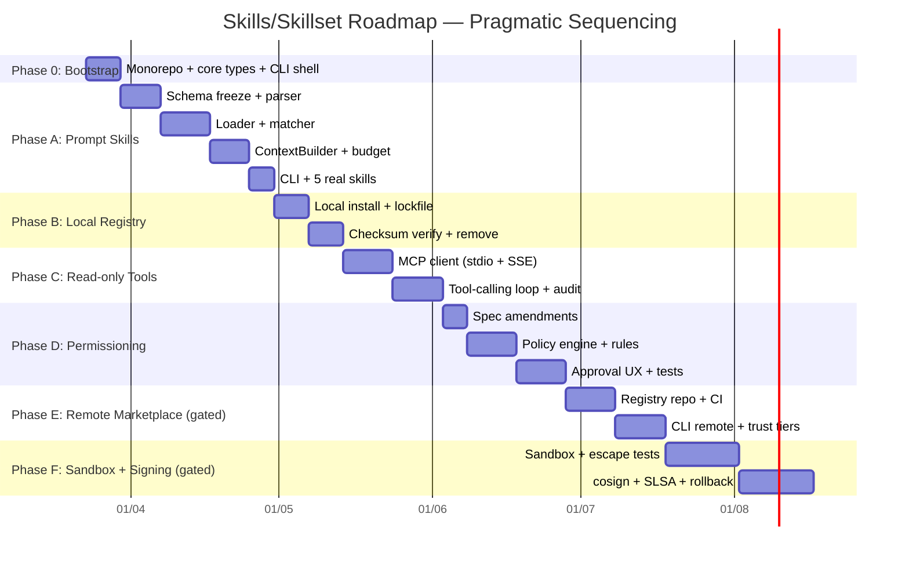

# Agent Orchestra — Skills/Skillset Work Packages

> Implementation plan: 7 phases (0, A-F) following a pragmatic "value first, infrastructure when needed" approach.
> Source: [plan-report.md](../plan-report.md) | Spec: [spec-v1.3-patch.md](../spec-v1.3-patch.md)

---

## Sequencing Rationale

The original M1→M2→M3→M4 sequence had a critical flaw: **it shipped the remote marketplace before permissioning and sandbox existed** — opening the door before building the wall. It also assumed spec v1.3 core was already implemented (it's not — the repo is empty).

The revised sequence:
1. **Bootstrap first** — the repo has zero source code, so Phase 0 scaffolds the minimum viable project
2. **Prove value** at each level before adding infrastructure for the next
3. **Build walls** (permissions) before **opening doors** (marketplace)
4. **Ship working skills** before building marketplace

## Skill Maturity Model

| Level | Types Allowed | Execution | Network | Phase |
|-------|--------------|-----------|---------|-------|
| **L0** | `prompt` only | None | None | Phase 0 → A → B |
| **L1** | `prompt`, `tool` (read-only) | MCP `fs.read` only | Denied | Phase C |
| **L2** | `prompt`, `tool` (read+write) | MCP full | Allowlist | Phase D → E |
| **L3** | `prompt`, `tool`, `plugin` | Sandbox | Restricted | Phase F |

**Hard rule:** Marketplace must NOT distribute skills above the current runtime maturity level.

## Timeline



## Work Packages

| Phase | File | Status | Tests |
|-------|------|--------|-------|
| [0: Bootstrap](phase-0-bootstrap.md) | `phase-0-bootstrap.md` | **Done** | — |
| [A: Prompt Skills](phase-a-prompt-skills.md) | `phase-a-prompt-skills.md` | **Done** | 216 |
| [B: Local Registry](phase-b-local-registry.md) | `phase-b-local-registry.md` | **Done** | +28 |
| [C: Read-only Tools](phase-c-readonly-tools.md) | `phase-c-readonly-tools.md` | **Done** | +43 |
| [D: Permissioning](phase-d-permissioning.md) | `phase-d-permissioning.md` | **Done** | +105 |
| [E: Marketplace](phase-e-remote-marketplace.md) | `phase-e-remote-marketplace.md` | **Done** | +62 |
| [F: Sandbox](phase-f-sandbox-signing.md) | `phase-f-sandbox-signing.md` | **Done** | +48 |
| [Core Engine](core-engine.md) | `core-engine.md` | **Done** | +121 |

**Total: 623 tests passing, 9 skipped (Docker-only)**

## Dependency Graph

```
Phase 0 (Bootstrap — repo has zero code)
  └─→ Phase A (Prompt Skills — prove value)
        └─→ Phase B (Local Registry — reproducible installs)
              └─→ Phase C (Read-only Tools — MCP, fs.read only)
                    └─→ Phase D (Permissioning — build the wall)
                          └─→ Phase E (Remote Marketplace — GATED)
                                └─→ Phase F (Sandbox + Signing — GATED)
```

## Security Per Phase (Embedded, Not Separate RFC)

| Phase | Security Deliverable | Format |
|-------|---------------------|--------|
| 0 | Capability enum + SSRF block constants as code | TypeScript constants |
| A | Schema freeze + prompt injection warnings | TypeScript types + sanitizer |
| B | Checksum verification at install + load | Lockfile manager |
| C | Env sanitization for MCP stdio + audit log | MCP client |
| D | Full policy engine + SSRF/bypass/timeout tests | Implementation + test suite |
| E | CI gates (secret scan, schema validation) | GitHub Actions |
| F | Sandbox hardening + escape tests + cosign | Implementation + test suite |

## Gated Phases

**Phase E gate (Remote Marketplace):**
- [ ] >10 real skills exist and are in use
- [ ] >3 external contributors have shown interest
- [ ] Skill format stable for >4 weeks
- [ ] Phase D operational

**Phase F gate (Sandbox + Signing):**
- [ ] Concrete use case requires `proc.spawn` or plugin execution
- [ ] External contributors submitting executable skills
- [ ] Phase E operational
- [ ] Budget approved

## Cost Estimate

| Phase | Duration | Est. Cost (USD) |
|-------|----------|----------------|
| 0: Bootstrap | 1 week | 3k – 5k |
| A: Prompt Skills | 4 weeks | 12k – 18k |
| B: Local Registry | 2 weeks | 6k – 10k |
| C: Read-only Tools | 3 weeks | 10k – 16k |
| D: Permissioning | 3.5 weeks | 12k – 20k |
| **Must-ship (0-D)** | **~13.5 weeks** | **43k – 69k** |
| E: Remote Marketplace | 3 weeks | 10k – 16k |
| F: Sandbox + Signing | 5 weeks | 18k – 30k |
| **Full (if all gates pass)** | **~21.5 weeks** | **71k – 115k** |

## Success Metrics Per Phase

| Phase | Quantifiable Metric | How to Measure |
|-------|-------------------|----------------|
| 0 | `tsc --build` passes, `vitest run` passes, `agent-orchestra --help` prints output | CI green on all 3 commands |
| A | 5 named skills load and inject into agent context; prompt tokens increase by expected amount | Integration test: MockProvider receives skill content; token count delta matches expected |
| B | `skills install ./path` + `skills verify` round-trip succeeds; lockfile checksum matches | CLI end-to-end test |
| C | 1 tool skill executes via MCP and returns artifact; audit log contains entry | Integration test with mock MCP server |
| D | Policy engine blocks SSRF (127.0.0.1, 169.254.169.254); approval flow pauses/resumes job | Security test suite + CLI interactive test |
| E | `skills install security-review` from remote registry succeeds; checksum verified | CLI end-to-end test against registry |
| F | Plugin runs in container; `cat /etc/passwd` returns container-local content; fork bomb killed | Sandbox escape test suite in CI |

## Archived (Old Structure)

The original M0-M4 work packages are preserved in `archive/` for reference:
- `archive/m0-security-rfc.md` — dissolved, security embedded per-phase
- `archive/m2-marketplace-mvp.md` — split into Phase B (local) + Phase E (remote)
- `archive/m3-permissioning-runtime.md` — split into Phase C (read-only) + Phase D (full permissions)
