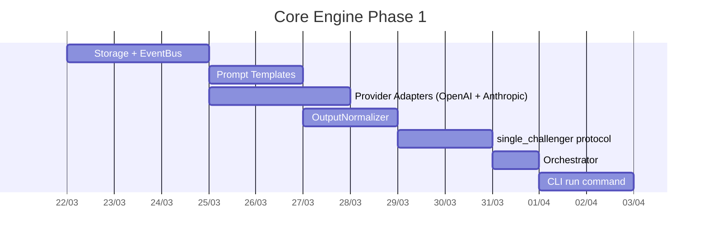

# Core Orchestration Engine — Implementation Plan

> **Goal:** Make `agent-orchestra run` work end-to-end — create a job, execute a protocol with real LLM providers, normalize output, synthesize results.
> **Scope:** Spec v1.3 Phase 1A (core loop), pragmatic subset.
> **Duration:** ~4-5 weeks.

---

## What Exists vs What's Needed

| Component | Current State | Needed |
|-----------|--------------|--------|
| Core types (§4) | All 40+ types implemented | Done |
| ContextBuilder | Working (with skill injection) | Done |
| Skill system | Fully implemented (Phases 0-F) | Done |
| Orchestrator | Type only | **Implement** |
| ProtocolRunner (single_challenger) | Interface only | **Implement** |
| ProviderAdapter (OpenAI) | Not built | **Implement** |
| ProviderAdapter (Anthropic) | Not built | **Implement** |
| OutputNormalizer | Interface only | **Implement** |
| PromptTemplates | Not built | **Implement** |
| JobStore / RoundStore | Type only | **Implement** |
| EventBus | Type only | **Implement** |
| SynthesisEngine | Type only | **Implement (basic)** |
| ClusteringEngine | Type only | **Implement (basic)** |
| ScopeGuard | Type only | **Implement (basic)** |
| CancellationRegistry | Interface only | **Implement** |
| CLI `run` command | Not built | **Implement** |
| CLI `job` commands | Not built | **Implement** |
| Storage layout (§11) | Not built | **Implement** |

## Pragmatic Phasing

### Engine Phase 1: Minimum Viable Run (2 weeks)

Ship the minimum to make `agent-orchestra run` work with a single protocol and one provider.

**E1.1 — Storage Layer** (~2 days)
- `packages/core/src/storage/job-store.ts` — JSON file-based job CRUD (create, load, update status, list)
- `packages/core/src/storage/round-store.ts` — save/load rounds as JSON files
- Storage layout per spec §11.1
- `packages/core/src/storage/event-logger.ts` — NDJSON event log

**E1.2 — EventBus** (~1 day)
- `packages/core/src/events/event-bus.ts` — simple typed EventEmitter
- Events: `job:update`, `round:start`, `round:complete`, `agent:output:end`, `error`

**E1.3 — Prompt Templates** (~2 days)
- `packages/core/src/templates/` — template types + loader
- Ship 4 default templates: `architect-analysis`, `reviewer-by-lens`, `architect-rebuttal`, `synthesis`
- Template rendering with variable substitution (brief, scope, findings, skill context)
- Versioned storage per spec §22.5

**E1.4 — Provider Adapters** (~3 days)
- `packages/providers/src/openai/` — OpenAI-compatible adapter (covers OpenAI, Azure, local proxies)
  - Uses OpenAI SDK or native fetch
  - Supports chat completions with structured output
  - Streaming support (emit `agent:output` events)
  - Timeout + retry with exponential backoff
  - Rate limit (429) handling with Retry-After
- `packages/providers/src/anthropic/` — Anthropic adapter
  - Uses Anthropic SDK or native fetch
  - Messages API with tool_use support
  - Streaming support
- `packages/providers/src/types.ts` — `AgentProvider` interface, `ProviderInput` type
- Credentials via env vars (OPENAI_API_KEY, ANTHROPIC_API_KEY)

**E1.5 — OutputNormalizer** (~2 days)
- `packages/core/src/output/normalizer.ts` — two-stage normalization
  - Strategy 1: structured sections → direct mapping to findings
  - Strategy 2: markdown-formatted raw text → regex/parser extraction
  - Strategy 3: unstructured → malformed (trigger retry)
- Finding parser: extracts Title, Scope, Actionability, Confidence, Evidence, Description from markdown format
- Deterministic, no LLM — per spec §35.1

**E1.6 — Protocol: single_challenger** (~2 days)
- `packages/core/src/protocols/single-challenger.ts`
- Steps: analysis → review → rebuttal → convergence
  1. Architect analyzes target (using architect-analysis template)
  2. Reviewer reviews with lens focus (using reviewer-by-lens template)
  3. Architect responds to findings (using architect-rebuttal template)
  4. Convergence: collect final findings
- CancellationRegistry implementation

**E1.7 — Orchestrator** (~1 day)
- `packages/core/src/orchestrator/orchestrator.ts` — per spec §8.3
- ProtocolRegistry (maps protocol name → runner)
- Job lifecycle: draft → queued → running → awaiting_decision → completed/failed
- Wire all dependencies into ProtocolExecutionDeps

**E1.8 — CLI `run` command** (~2 days)
- `agent-orchestra run` — interactive job creation + execution
  - `--provider openai|anthropic` (default: openai)
  - `--model gpt-4o|claude-sonnet-4-20250514` (default: gpt-4o)
  - `--target <file-or-dir>` — what to review
  - `--lens <lens>` — review focus (security, testing, performance, etc.)
  - `--brief <text>` — job description
  - `--protocol single_challenger` (default)
- Reads target files, builds scope, creates job, runs protocol
- Streams agent output to terminal
- At completion: shows synthesis with findings

### Engine Phase 2: Polish + Multi-agent (2-3 weeks)

**E2.1 — Basic SynthesisEngine** — merge findings from all rounds into final output
**E2.2 — Basic ClusteringEngine** — title normalization grouping (spec §35.2)
**E2.3 — Basic ScopeGuard** — tag findings as primary/reference/out_of_scope
**E2.4 — CLI `job` commands** — `job list`, `job show <id>`, `job inspect <id>`
**E2.5 — FailurePolicy + retry** — handle provider failures per spec §9
**E2.6 — Integration tests** — end-to-end with MockProvider

---

## Implementation Order (Engine Phase 1)



## Files to Create

```
packages/core/src/
  storage/
    job-store.ts              # JSON file-based job persistence
    round-store.ts            # Round data persistence
    event-logger.ts           # NDJSON event logging
    types.ts                  # Store interfaces
    index.ts
  events/
    event-bus.ts              # Typed EventEmitter
    types.ts                  # Event types
    index.ts
  templates/
    types.ts                  # PromptTemplate, PromptTemplateRole
    loader.ts                 # Load + render templates
    renderer.ts               # Variable substitution
    defaults/                 # Default template files
      architect-analysis.md
      reviewer-by-lens.md
      architect-rebuttal.md
      synthesis.md
    index.ts
  output/
    normalizer.ts             # Two-stage OutputNormalizer
    finding-parser.ts         # Markdown → Finding[] parser
    index.ts
  protocols/
    single-challenger.ts      # SingleChallengerRunner
    registry.ts               # ProtocolRegistry
    index.ts
  orchestrator/
    orchestrator.ts           # Main Orchestrator class
    cancellation.ts           # CancellationRegistry impl
    index.ts

packages/providers/              # NEW PACKAGE
  src/
    types.ts                  # AgentProvider, ProviderInput
    openai/
      adapter.ts              # OpenAI-compatible provider
      index.ts
    anthropic/
      adapter.ts              # Anthropic provider
      index.ts
    index.ts
  package.json
  tsconfig.json
  tsup.config.ts

apps/cli/src/
  commands/
    run.ts                    # `agent-orchestra run` command
    job.ts                    # `agent-orchestra job list/show/inspect`
```
